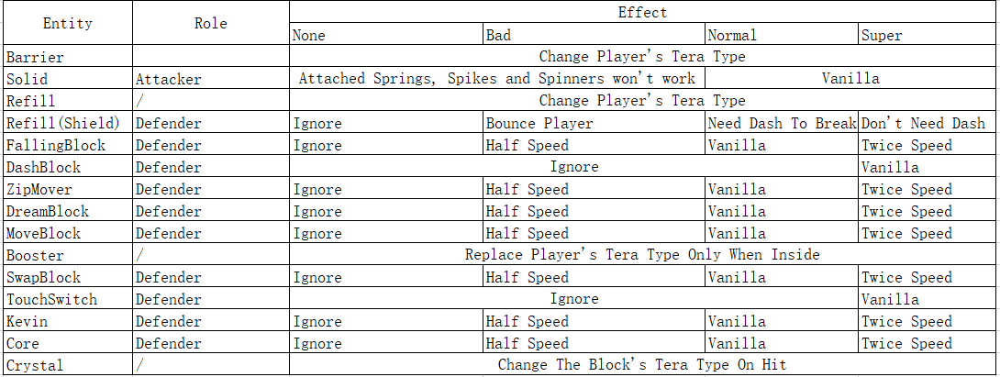

# TeraHelper
Add Tera logic to the game.  
Madeline will have a tera type, and she can interact with other tera entities. The key point is to figure out who is the attacker and who is the defender and then get a tera effect. Tera entities behave differently according to the tera effect. Here is the detail list.  

Take Kevin as an example. It can act as a defender, so Madeline is the attacker. If Kevin is Ghost type and Madeline is Dark type, the effect will be super effective. So the Kevin will move twice faster after Madeline dashes to it. However if Kevin is Fairy type and Madeline is Dragon type, there will be no effect and Kevin won't be activated.  
Also Kevin is a solid block, so it can act as a attacker as well. If Kevin is Grass Type and Madeline is Dragon Type, the effect will be not good. So spikes attached on the Kevin won't hurt Madeline, and springs on the Kevin won't bounce Madeline.
What's more, if Kevin hit a falling block, then Kevin is the attacker and falling block is the defender. If there is no effect then the falling block won't fall.
In conclusion, if the entity is a block and has move speed (e.g. Zip Mover), it will get different speed according to the effect. If the entity if a block and can be triggered (e.g. Dash Block), it can only be triggered when the effect is super effective.  
Normally the game limit Madeline's lift boost speed from blocks up to 250f at X and -130f at Y. The lift boost speed form tera blocks can break this rule.